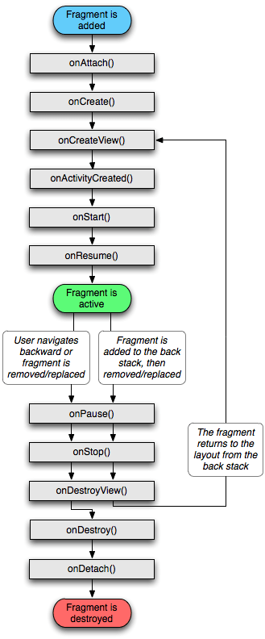
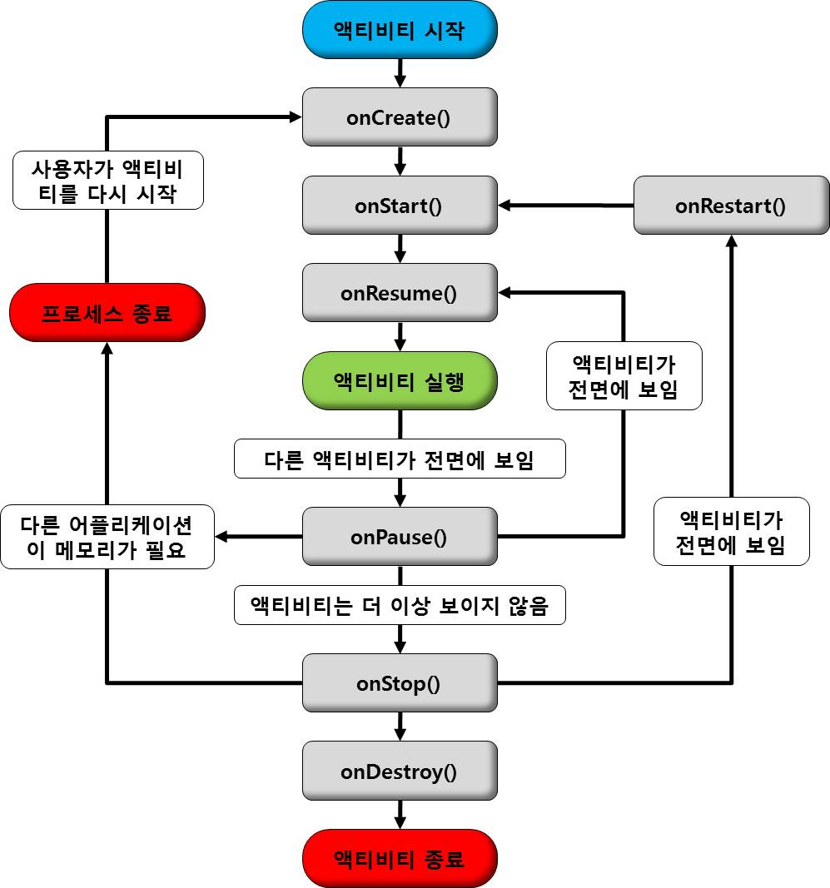

# 안드로이드 공부

## Fragment 생명 주기

- onAttach
- onCreate
- onCreateView
- onActivityCreated
- onStart
- onResume
- onPause
- onStop
- onDestroyView
- onDestroy
- onDetach

### onAttach
> Fragment가 Activity에 attach될 때 호출이 된다

### onCreate

> Activity의 onCreate와 비슷하나 ui와 관련된 일은 할 수 없다.

Activity와 마찬가지로 초기화해야 하는 리소스들을 넣어준다.

### onCreateView

> Layout을 inflate하는 부분, view와 관련된 작업을 할 수 있다.

### onActivityCreated

> Fragment에서 onCreateView를 마치고, Activity의 onCreate가 실행된 후 호출되는 함수

Fragment와 Activity의 모든 View가 생성된 상태이므로 뷰를 변경하는 작업이 가능하다.

### onStart

> Activity의 onStart와 비슷하다. 

- Activity의 onStart가 호출된 상태이다.
- 사용자에게 Fragment가 보이게 해준다.

### onResume

> Activity의 onResume와 비슷하다.

- 사용자가 Fragment와 상호작용하기 직전에 호출되는 함수

### onPause

> Activity의 onPause와 유사하다.

- 해당 Fragment의 Activity외에 다른 Activity가 화면에 나오면 호출되는 함수

### onStop

> Activity의 onPause와 유사하다.

- 해당 Fragment의 Activity가 다른 Activity에 의해 완전히 가려지게 되면 호출 되는 함수이다.

### onDestroyView

> Fragment의 View가 제거될 때 호출되는 함수이다.

### onDestroy

> Fragment가 종료될 때 호출되는 함수이다.

### onDetach

> Fragment가 Activity로부터 해제될 때 호출되는 함수이다.

## 안드로이드 생명 주기

- onCreate
- onStart
- onResume
- onPuase
- onStop
- onRestart
- onDestroy

### onCreate

> Activiy가 처음 실행되는 상태에 제일 먼저 호출되는 메소드이며, 최초로 한번만 실행되는 함수이다.

Activiy가 처음 실행되는 상태에 제일 먼저 호출되는 메소드이며, 최초로 한번만 실행되는 함수이다. 사용자에게 UI를 띄어주기 위한 메소드인 `setContentView`()메소드가 포함되어 있다.

### onStart

> Activity가 사용자에게 보여지기 직전에 호출되는 함수

### onResume

> Activity가 사용자에게 보여지고, 사용자와 상호작용하기 직전에 호출되는 함수

Activiy가 멈춰있다가 다시 호출될 때 불리는 함수, `Pause`상태였다가 다시 호출될 때 불린다.

### onPause
> 현재 사용중인 Activity위에 다른 Activity가 올라와 focus를 잃었을 때 호출되는 함수

### onStop
> 현재 사용중인 Activity가 더 이상 사용자에게 보여지지 않을 경우 호출되는 함수이다.

### onRestart
> Stop된 Activity가 다시 시작할려고 할 때 호출되는 함수이다.

### onDestroy
> Activity가 종료될 때 호출되는 함수이다.