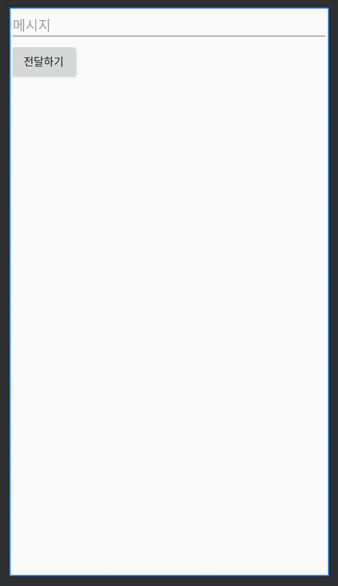

# 07장 인텐트와 인텐트 필터

## 전화걸기 앱 만들기

### ImplicitIntentExam

> activity_main.xml

```java
<?xml version="1.0" encoding="utf-8"?>
<LinearLayout xmlns:android="http://schemas.android.com/apk/res/android"
    xmlns:tools="http://schemas.android.com/tools"
    android:id="@+id/activity_main"
    android:layout_width="match_parent"
    android:layout_height="match_parent"
    tools:context="com.example.implicitintentexam.MainActivity">

    <EditText
        android:id="@+id/phone_number_edit"
        android:layout_width="0dp"
        android:layout_height="wrap_content"
        android:layout_weight="1"
        android:hint="전화번호를 입력 해 주세요"
        android:inputType="phone" />

    <Button
        android:layout_width="wrap_content"
        android:layout_height="wrap_content"
        android:onClick="dialPhone"
        android:text="전화걸기" />
</LinearLayout>
```

> MainActivity.java

```java
public class MainActivity extends AppCompatActivity {

    @Override
    protected void onCreate(Bundle savedInstanceState) {
        super.onCreate(savedInstanceState);
        setContentView(R.layout.activity_main);
    }

    public void dialPhone(View view) {
        EditText editText = (EditText) findViewById(R.id.phone_number_edit);
        dialPhoneNumber(editText.getText().toString());
    }

    // 전화걸기
    public void dialPhoneNumber(String phoneNumber) {
        // 암시적 인텐트인 ACTION_DIAL을 설정
        Intent intent = new Intent(Intent.ACTION_DIAL);
        // URI 형태의 전화번호를 데이터로 설정
        intent.setData(Uri.parse("tel:" + phoneNumber));
        // 이러한 Intent를 처리할 수 있는 Activity를 찾는다면 액티비티를 시작
        if (intent.resolveActivity(getPackageManager()) != null) {
            startActivity(intent);
        }
    }

    // 알람 설정
    // AndroidManifest.xml 에 <uses-permission android:name="com.android.permission.SET_ALARM" /> 권한 추가 필요
    public void createAlarm(String message, int hour, int minutes) {
        Intent intent = new Intent(AlarmClock.ACTION_SET_ALARM)
                .putExtra(AlarmClock.EXTRA_MESSAGE, message)
                .putExtra(AlarmClock.EXTRA_HOUR, hour)
                .putExtra(AlarmClock.EXTRA_MINUTES, minutes);
        if (intent.resolveActivity(getPackageManager()) != null) {
            startActivity(intent);
        }
    }

    // 일정 추가
    public void addEvent(String title, String location, Calendar begin, Calendar end) {
        Intent intent = new Intent(Intent.ACTION_INSERT)
                .setData(CalendarContract.Events.CONTENT_URI)
                .putExtra(CalendarContract.Events.TITLE, title)
                .putExtra(CalendarContract.Events.EVENT_LOCATION, location)
                .putExtra(CalendarContract.EXTRA_EVENT_BEGIN_TIME, begin)
                .putExtra(CalendarContract.EXTRA_EVENT_END_TIME, end);
        if (intent.resolveActivity(getPackageManager()) != null) {
            startActivity(intent);
        }
    }

    // 카메라로 사진이나 동영상 찍고 결과를 받기
    static final int REQUEST_IMAGE_CAPTURE = 1;
    static final Uri mLocationForPhotos = Uri.parse("content://사진경로");

    public void capturePhoto(String targetFilename) {
        Intent intent = new Intent(MediaStore.ACTION_IMAGE_CAPTURE);
        intent.putExtra(MediaStore.EXTRA_OUTPUT,
                Uri.withAppendedPath(mLocationForPhotos, targetFilename));
        if (intent.resolveActivity(getPackageManager()) != null) {
            startActivityForResult(intent, REQUEST_IMAGE_CAPTURE);
        }
    }

    @Override
    protected void onActivityResult(int requestCode, int resultCode, Intent data) {
        if (requestCode == REQUEST_IMAGE_CAPTURE && resultCode == RESULT_OK) {
            Bitmap thumbnail = data.getParcelableExtra("data");
        }
    }

    // 사진 찍기 모드로 사진 앱 시작
    static final int REQUEST_CAPTURE_PHOTO = 2;

    public void capturePhoto() {
        Intent intent = new Intent(MediaStore.INTENT_ACTION_STILL_IMAGE_CAMERA);
        if (intent.resolveActivity(getPackageManager()) != null) {
            startActivityForResult(intent, REQUEST_CAPTURE_PHOTO);
        }
    }

    // 동영상 촬영 모드로 사진 앱 시작
    static final int REQUEST_CAPTURE_VIDEO = 3;

    public void captureVideo() {
        Intent intent = new Intent(MediaStore.INTENT_ACTION_STILL_IMAGE_CAMERA);
        if (intent.resolveActivity(getPackageManager()) != null) {
            startActivityForResult(intent, REQUEST_CAPTURE_VIDEO);
        }
    }


    // 연락처 선택
    static final int REQUEST_SELECT_CONTACT = 4;
    public void selectContact() {
        Intent intent = new Intent(Intent.ACTION_PICK);
        intent.setType(ContactsContract.Contacts.CONTENT_TYPE);
        if (intent.resolveActivity(getPackageManager()) != null) {
            startActivityForResult(intent, REQUEST_SELECT_CONTACT);
        }
    }


    // 연락처 보기
    public void viewContact(Uri contactUri) {
        Intent intent = new Intent(Intent.ACTION_VIEW, contactUri);
        if (intent.resolveActivity(getPackageManager()) != null) {
            startActivity(intent);
        }
    }


    // 연락처 편집
    public void editContact(Uri contactUri, String email) {
        Intent intent = new Intent(Intent.ACTION_EDIT);
        intent.setData(contactUri);
        intent.putExtra(ContactsContract.Intents.Insert.EMAIL, email);
        if (intent.resolveActivity(getPackageManager()) != null) {
            startActivity(intent);
        }
    }

    // 연락처 추가
    public void insertContact(String name, String email) {
        Intent intent = new Intent(Intent.ACTION_INSERT);
        intent.setType(ContactsContract.Contacts.CONTENT_TYPE);
        intent.putExtra(ContactsContract.Intents.Insert.NAME, name);
        intent.putExtra(ContactsContract.Intents.Insert.EMAIL, email);
        if (intent.resolveActivity(getPackageManager()) != null) {
            startActivity(intent);
        }
    }

    // 첨부가 있는 메일 쓰기
    public void composeEmail(String[] addresses, String subject, Uri attachment) {
        Intent intent = new Intent(Intent.ACTION_SEND);
        intent.setType("*/*");
        intent.putExtra(Intent.EXTRA_EMAIL, addresses);
        intent.putExtra(Intent.EXTRA_SUBJECT, subject);
        intent.putExtra(Intent.EXTRA_STREAM, attachment);
        if (intent.resolveActivity(getPackageManager()) != null) {
            startActivity(intent);
        }
    }

    // 이메일 쓰기
    public void composeEmail(String[] addresses, String subject) {
        Intent intent = new Intent(Intent.ACTION_SENDTO);
        intent.setData(Uri.parse("mailto:")); // only email apps should handle this
        intent.putExtra(Intent.EXTRA_EMAIL, addresses);
        intent.putExtra(Intent.EXTRA_SUBJECT, subject);
        if (intent.resolveActivity(getPackageManager()) != null) {
            startActivity(intent);
        }
    }

    // 특정 파일 얻기
    static final int REQUEST_IMAGE_GET = 5;
    public void selectImage() {
        Intent intent = new Intent(Intent.ACTION_GET_CONTENT);
        intent.setType("image/*");
        if (intent.resolveActivity(getPackageManager()) != null) {
            startActivityForResult(intent, REQUEST_IMAGE_GET);
        }
    }
//    @Override
//    protected void onActivityResult(int requestCode, int resultCode, Intent data) {
//        if (requestCode == REQUEST_IMAGE_GET && resultCode == RESULT_OK) {
//            Bitmap thumbnail = data.getParcelableExtra("data");
//            Uri fullPhotoUri = data.getData();
//            // fullPhotoUri를 통해 이미지를 얻고 작업
//        }
//    }


    // 특정 파일 타입 열기
    static final int REQUEST_IMAGE_OPEN = 6;
    public void selectImageType() {
        Intent intent = new Intent(Intent.ACTION_OPEN_DOCUMENT);
        intent.setType("image/*");
        intent.addCategory(Intent.CATEGORY_OPENABLE);
        startActivityForResult(intent, REQUEST_IMAGE_OPEN);
    }

//    @Override
//    protected void onActivityResult(int requestCode, int resultCode, Intent data) {
//        if (requestCode == REQUEST_IMAGE_GET && resultCode == RESULT_OK) {
//            Uri fullPhotoUri = data.getData();
//            // fullPhotoUri를 통해 이미지를 얻고 작업
//        }
//    }


    // 지도 보기
    public void showMap(Uri geoLocation) {
        Intent intent = new Intent(Intent.ACTION_VIEW);
        intent.setData(geoLocation);
        if (intent.resolveActivity(getPackageManager()) != null) {
            startActivity(intent);
        }
    }


    // 미디어 파일 재생
    public void playMedia(Uri file) {
        Intent intent = new Intent(Intent.ACTION_VIEW);
        intent.setData(file);
        if (intent.resolveActivity(getPackageManager()) != null) {
            startActivity(intent);
        }
    }


    // 웹 검색
    public void searchWeb(String query) {
        Intent intent = new Intent(Intent.ACTION_SEARCH);
        intent.putExtra(SearchManager.QUERY, query);
        if (intent.resolveActivity(getPackageManager()) != null) {
            startActivity(intent);
        }
    }

    // 설정 메뉴 (와이파이 설정)
    public void openWifiSettings() {
        Intent intent = new Intent(Settings.ACTION_WIFI_SETTINGS);
        if (intent.resolveActivity(getPackageManager()) != null) {
            startActivity(intent);
        }
    }


    // 문자 보내기
    public void composeMmsMessage(String message, Uri attachment) {
        Intent intent = new Intent(Intent.ACTION_SENDTO);
        intent.setType("text/plain");
        intent.putExtra("sms_body", message);
        intent.putExtra(Intent.EXTRA_STREAM, attachment);
        if (intent.resolveActivity(getPackageManager()) != null) {
            startActivity(intent);
        }
    }

    // URL 열기
    public void openWebPage(String url) {
        Uri webpage = Uri.parse(url);
        Intent intent = new Intent(Intent.ACTION_VIEW, webpage);
        if (intent.resolveActivity(getPackageManager()) != null) {
            startActivity(intent);
        }
    }
}
```

## 카카오톡에 메시지 보내기

### ActionSendExam

# ActionSendExam

> activity_main.xml

```xml
<?xml version="1.0" encoding="utf-8"?>
<LinearLayout xmlns:android="http://schemas.android.com/apk/res/android"
    xmlns:tools="http://schemas.android.com/tools"
    android:layout_width="match_parent"
    android:layout_height="match_parent"
    android:orientation="vertical"
    tools:context="com.example.actionsendexam.MainActivity">

    <EditText
        android:id="@+id/message_edit"
        android:layout_width="match_parent"
        android:layout_height="wrap_content"
        android:hint="메시지" />

    <Button
        android:layout_width="wrap_content"
        android:layout_height="wrap_content"
        android:onClick="sendMessage"
        android:text="전달하기" />

</LinearLayout>
```



> MainActivity.java

```java
public class MainActivity extends AppCompatActivity {

    @Override
    protected void onCreate(Bundle savedInstanceState) {
        super.onCreate(savedInstanceState);
        setContentView(R.layout.activity_main);
    }

    public void sendMessage(View view) {
        EditText messageEditText = (EditText) findViewById(R.id.message_edit);

        Intent intent = new Intent(Intent.ACTION_SEND);
        intent.setType("text/plain");
        intent.putExtra(Intent.EXTRA_TEXT, messageEditText.getText().toString());

        // 처리할 수 있는 액티비티가 있으면 그 액티비티를 실행하라
        if (intent.resolveActivity(getPackageManager()) != null) {
            startActivity(intent);
        }
    }
}
```